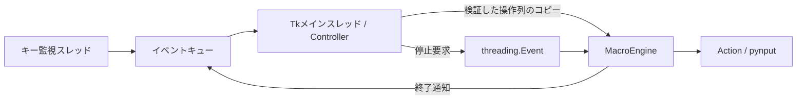

# Macro Generator / AutoClicker

**クリックとキー入力を順番に実行する、Windows向けのデスクトップマクロ編集アプリです。** Python・Tkinter・pynputを使用し、座標や押下時間、待機間隔、繰り返しをGUIで設定できます。

過去に本人が制作したアプリを、就職活動に向けて現在の知識とAIツールを活用し、レビュー・改善しました。既存機能と技術スタックを維持し、動作の安定性、読みやすさ、再現可能な実行手順を整備しています。

## 目的

アプリの用途は、繰り返すマウス・キーボード操作を操作列として登録し、保存・再実行できるようにすることです。今回の見直しでは、第三者がコードと挙動を確認しやすい状態を目指しました。制作当時の個人的なきっかけや利用実績は、確認できる記録がないため記載していません。

## 主な機能

- 座標指定の左・右クリック（JSONでは中央ボタンも対応）
- 1文字またはEnter等の特殊キー入力
- 押下時間と、操作後の待機間隔の設定
- 操作列の繰り返し、入れ子ループ
- アクションの追加・編集・削除、ドラッグによる並べ替え
- グローバルホットキーによる開始・停止、現在座標のクリック登録
- ホットキーの変更と、JSONプリセットの保存・読込

## 使用技術

| 技術 | 用途 |
|---|---|
| Python 3.12以上 | アプリケーション本体（動作検証は3.12.10） |
| Tkinter / ttk | デスクトップGUI、Canvasによる独自スライダー |
| pynput | マウス・キーボード操作、グローバルキー監視 |
| dataclasses / threading / queue | 操作データ、別スレッド実行、GUIへのイベント通知 |
| JSON | ホットキー設定と操作列の保存 |
| uv / uv.lock | 依存関係と環境の再現 |
| unittest / Ruff | 回帰テスト、lint・format |
| PyInstaller / Inno Setup | 任意のWindows配布用ビルド |

## 技術的に工夫した点

元の実装では、GUIとマクロ実行エンジンが分離され、dataclassで操作を表現していました。また、ループ開始位置と残り回数をスタックに保持し、入れ子の繰り返しを処理しています。

今回の改善では、監視・実行スレッドからの通知をキューに集約しました。Tkのメインスレッドが20ms間隔で通知を処理し、GUIを更新します。停止要求後はスレッドの終了まで再実行を許可せず、待機はEventで中断します。押下後はfinallyでキーやボタンの解放を試みます。

JSONは全体を検証してから現在の画面へ反映します。保存は同一ディレクトリの一時ファイルを置換する方式とし、書込失敗時に既存ファイルを残します。



## プロジェクト構成

```text
main.py                       起動、Windowsアイコン設定
pyproject.toml / uv.lock       実行・開発・ビルド依存
MacroGenerator.spec           EXEビルド定義
installer_setup_script.iss     インストーラー定義
icon.ico                      既存アプリアイコン
auto_clicker/
 ├─ core/
 │  ├─ actions.py             操作データ、検証、入力実行
 │  ├─ engine.py              別スレッド実行、ループ、停止
 │  ├─ controller.py          キュー処理、開始・終了の状態管理
 │  ├─ presets.py             プリセット検証・入出力
 │  └─ settings.py            ホットキー設定管理
 ├─ gui/
 │  ├─ main_window.py         メニュー、一覧、各部品の連携
 │  ├─ action_form.py         アクション入力・編集
 │  ├─ settings_dialog.py     ホットキー変更
 │  └─ widgets.py             並べ替えリスト、独自スライダー
 └─ utils.py                  JSON入出力、キー表現の変換
examples/                     サンプル設定・プリセット
tests/                        実入力をモック化した回帰テスト
docs/                         改善比較・応募用文章・検証記録
```

## インストール

Windows 11、Python 3.12（Tkinterを含む）、uvを用意してください。現時点ではWindowsを検証対象としています。

1. このリポジトリをcloneまたはZIPで取得し、展開先でPowerShellを開きます。
2. 次のコマンドで依存をインストールします。

```powershell
uv sync --locked --no-dev
```

既存の`.venv`や`config.json`は不要です。標準設定で起動できます。Pythonは[公式配布](https://www.python.org/downloads/windows/)、uvは[公式インストール案内](https://docs.astral.sh/uv/getting-started/installation/)を参照してください。

## 実行

リポジトリのルートで実行します。

```powershell
uv run --no-dev --locked python main.py
```

設定はルートの`config.json`、プリセットの既定保存先は`presets/`です。EXE版ではEXEの隣に保存します。これらのローカルデータはGit管理対象外です。既存の`config.json`がある場合は、そのホットキーが優先されます。

## 操作方法

### まず試す

1. 「ファイル → 設定を開く」から`examples/type_a_twice.json`を読み込みます。
2. 空のメモ帳を開き、入力欄へフォーカスを移します。
3. **F1**で実行します。`a`を1秒間隔で2回入力します。途中停止は**F2**です。

このサンプルも実際のキー入力を送信するため、入力先を確認してから開始してください。

### 操作列を作る

- **クリック**：X・Y座標、左右のボタン、継続時間、待機間隔を指定して「追加」。ホットキーでもカーソルの現在座標を登録できます。
- **キー**：「キーを設定」を押してキーを取得し「追加」。ホットキーと同じキーは使用できません。
- **ループ**：操作を追加した後、回数を指定して「追加」。現在の一覧全体を開始・終了行で囲みます。繰り返して追加すると入れ子になります。
- **編集・削除**：一覧を右クリック。削除はDeleteキーでも可能です。
- **並べ替え**：行をドラッグします。ループ開始・終了の対応が崩れた場合は、保存・実行時にエラーを表示します。
- **保存**：「ファイル → 設定を保存」。プリセットには操作列と現在のホットキーを保存します。
- **ホットキー変更**：「編集 → ホットキー設定...」。OKで`config.json`へ保存します。

| 操作 | 設定ファイルがない場合の既定キー |
|---|---|
| 開始 | F1 |
| 停止 | F2 |
| 現在座標の左クリックを追加 | F11 |
| 現在座標の右クリックを追加 | F12 |

現在の割り当ては画面左側に表示します。以前の設定がF9/F10の場合も、その設定を保持します。開始・停止用の画面ボタンはありません。

「継続時間」は押したままにする時間、「待機間隔」は操作後の休憩時間です。スライダーは0〜5秒、直接入力ではそれより長い有限の非負値も指定できます（OSの待機上限以内）。クリックではカーソル移動後に最大0.05秒の待機も入ります。

## 開発・テスト

```powershell
uv sync --locked
uv run --locked python -B -m unittest discover -s tests -v
uv run --locked ruff check .
uv run --locked ruff format --check .
```

テストでは入力送信をモック化し、ループ順序、停止、再実行、押下解放、JSON検証、読込失敗時の状態保持、GUIの編集処理を確認します。GUIテストにはTkが動くデスクトップ環境が必要です。詳細は[検証記録](docs/VALIDATION.md)に記載しています。

## Windows EXEのビルド（任意）

```powershell
uv sync --locked --group build
uv run --locked --group build pyinstaller --noconfirm MacroGenerator.spec
```

出力は`dist/MacroGenerator.exe`です。Inno Setupがある場合は、続けて次のコマンドでインストーラーを作成できます。

```powershell
ISCC installer_setup_script.iss
```

EXEのビルドは確認しています。Inno Setupによるインストーラーのコンパイル・インストールは未検証です。

## 注意事項

- 操作はその時点のデスクトップやフォーカス先へ送られます。最初は空のメモ帳などで短い操作列を試してください。
- 実行前に停止キーを確認してください。OSの入力処理やGUIの負荷により、停止要求から実際の停止まで遅延があります。
- 座標は画面配置に依存します。画面解像度・DPI・マルチモニター構成を変えた場合は座標を確認してください。
- 管理者権限で動くアプリや、入力を制限するアプリへの動作は保証していません。
- 標準では単独キーを順次入力します。複数キー同時押しや画面認識は実装していません。
- 読み込んだプリセットが不正な場合は元の一覧を維持します。壊れたホットキー設定は上書きせず、警告して既定値で起動します。
- アプリの配置先には設定・プリセットを書き込める権限が必要です。既存EXEをProgram Files等へ手動配置した場合は保存できないことがあります。
- 操作対象のサービスやアプリの利用条件に従って使用してください。

## 今回の改善

過去に制作したアプリを、現在の知識とAIツールを活用してレビュー・改善しました。既存のGUI、操作データ、スタックによるループ処理を活かし、自然終了後の再実行不具合、停止中の状態管理、GUIへのスレッド間通知、JSON読込・保存処理を見直しました。重要なロジックの回帰テスト、依存・ビルド設定、実行手順も整備しました。

設計提案、修正コード、テスト、文章の作成にはAIの補助を利用しています。元々の機能と今回の変更、維持した設計、その理由は[Git履歴に基づく比較](docs/REVIEW.md)に記載しました。[応募・面接用メモ](docs/PORTFOLIO.md)も参照できます。

## 今後改善できる点

- 実機入力、複数画面、DPI設定、管理者権限を含む環境別検証
- GUI上の開始・停止ボタン、実行位置の表示
- JSONの形式バージョンと将来の移行方針
- インストーラーの実機検証、署名・配布手順の整備
- アイコン等の素材の権利確認と、公開時のライセンス方針の決定

元のリポジトリにライセンスファイルやアイコンの出典説明は確認できなかったため、今回任意のライセンスや権利情報を付与していません。
